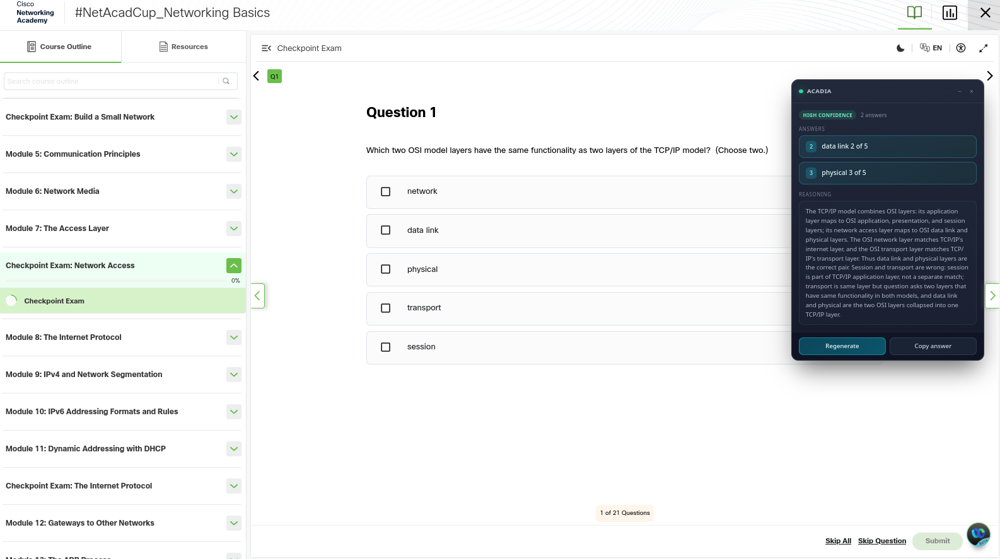

# Acadia

> Fork of **[vbatecan/netacad-autoanswer](https://github.com/vbatecan/netacad-autoanswer)** by Vince Angelo Batecan. All original credit goes to the upstream author; this fork adds multi-provider LLM support, generic question-type handling, a Cisco-domain prompt pipeline, a redesigned UI, and cross-browser support.

AI study companion for Cisco Networking Academy (NetAcad / Skills for All) courses. Explains quiz questions with reasoning and confidence scores. Bring your own LLM key — supports Gemini, Groq, OpenRouter, and Ollama. Runs on Chrome, Firefox, and every browser built on either engine.

[](LICENSE)
[](https://developer.mozilla.org/en-US/docs/Mozilla/Add-ons/WebExtensions/manifest.json)
[](https://www.mozilla.org/firefox/)
[](https://www.google.com/chrome/)

Acadia attaches a small floating panel to `netacad.com` pages. When you open a quiz, it reads the question, identifies its type (single-choice MCQ, multi-select, ordering, matching, fill-in, etc.), and asks your configured LLM to reason through it — returning the most likely correct option(s) with a short explanation of *why*.

It's a study tool. It tells you how to think about a question; the goal is for you to internalize Cisco's terminology and reasoning patterns, not to skip the work.

---

## Features

- **Multi-provider LLM support**
  - **Google Gemini** — free tier (1500 req/day on `gemini-2.0-flash`)
  - **Groq** — fastest inference, free tier with daily cap
  - **OpenRouter** — aggregator including many free-tier models
  - **Ollama** — local, fully offline, zero token cost
- **Auto-detects question type:** radio MCQ, checkbox multi-select, ordering, matching, fill-in, hotspot, generic
- **Verbatim option matching:** numbered options in the prompt, model returns 1-based indices, panel highlights the matching choice exactly
- **Forced chain-of-thought** via JSON schema — the model must reason before committing
- **Accuracy mode** — optional second verification pass for tricky questions
- **Lesson context** — paste your own notes; the model treats them as authoritative
- **Local answer cache** — re-visiting the same question doesn't re-burn API quota
- **In-flight dedup** — DOM mutations don't double-fire requests
- **Modern UI** — glass-effect floating panel, draggable, minimize/close, copy-answer button
- **Cross-browser** — single codebase runs on Chromium (Chrome / Brave / Edge / Vivaldi / Arc / Opera) and Gecko (Firefox / LibreWolf / Zen / Floorp). Manifest V3.

## Screenshot



Acadia detects the "Choose two" instruction, recognizes the checkbox input type, returns both correct options with their original indices, and explains the reasoning behind the answer.

## Installation

Acadia is a Manifest V3 extension that runs on both Chromium- and Gecko-based browsers from the same codebase.

### Firefox / LibreWolf / Zen / Floorp

1. Download `acadia-<version>.xpi` from the [latest release](https://github.com/plushyushy/acadia/releases) (or build it locally with `./build.sh`).
2. Open `about:debugging#/runtime/this-firefox`.
3. Click **Load Temporary Add-on…** → pick the `.xpi`.
4. To make the install persist across browser restarts, sign via [AMO](https://addons.mozilla.org/), or in LibreWolf set `xpinstall.signatures.required = false` in `about:config` and install the xpi normally via the address bar.

### Chrome / Brave / Edge / Vivaldi / Arc / Opera

You have two options.

**Option A — Load unpacked (developer mode):**

1. Download `acadia-<version>-chrome.zip` from the [latest release](https://github.com/plushyushy/acadia/releases) and extract it, OR clone this repository.
2. Open `chrome://extensions` (or `brave://extensions`, `edge://extensions`, etc.).
3. Enable **Developer mode** (toggle in the top-right corner).
4. Click **Load unpacked** → pick the extracted folder (or the `acadia/` folder if you cloned).

The extension will load until the browser flags it as a "developer-mode extension" on each launch. To suppress that nag without the Web Store, repackage as a `.crx` and have your browser load that, or use Option B.

**Option B — Chrome Web Store** _(not yet published)_:

Not yet available. If you'd like to maintain a Web Store listing, see [docs/PROVIDERS.md](docs/PROVIDERS.md) for nothing useful and [the developer dashboard](https://chrome.google.com/webstore/devconsole/) for everything.

### Configuration

1. Click the Acadia toolbar icon.
2. Pick a provider tab (recommended: **Gemini** — easiest free tier).
3. Paste your API key — see [docs/PROVIDERS.md](docs/PROVIDERS.md) for where to get one for each provider.
4. Click **Save**.
5. Open a NetAcad quiz. The panel appears in the top-right and analyzes the question automatically.

Keyboard shortcut to re-trigger analysis: <kbd>Alt</kbd> + <kbd>Shift</kbd> + <kbd>Q</kbd>

## How it works

```
┌────────────────────────────────────────────────────────────┐
│  netacad.com page                                          │
│                                                            │
│  ┌──────────────────────┐    ┌────────────────────────┐   │
│  │  Quiz <mcq-view>     │    │  Acadia floating panel │   │
│  │  (Cisco shadow DOM)  │    │  (injected by content) │   │
│  └──────────┬───────────┘    └────────┬───────────────┘   │
│             │                         │                    │
└─────────────┼─────────────────────────┼────────────────────┘
              │                         │
              ▼                         │
   ┌──────────────────────┐             │
   │  scraper.js          │             │
   │  - finds mcq-view    │             │
   │  - reads question +  │             │
   │    options + types   │             │
   │  - falls back to     │             │
   │    generic scrape    │             │
   │    for ordering/etc. │             │
   └──────────┬───────────┘             │
              │                         │
              ▼                         │
   ┌──────────────────────┐             │
   │  api.js              │             │
   │  - numbers options   │             │
   │  - builds prompt     │             │
   │  - calls provider    │             │
   │  - extracts JSON     │             │
   │  - caches result     │             │
   └──────────┬───────────┘             │
              │                         │
              ▼                         │
   ┌──────────────────────┐             │
   │  background.js       │             │
   │  - proxies HTTP to   │             │
   │    LLM provider      │             │
   │  - handles auth      │             │
   └──────────┬───────────┘             │
              │                         │
              ▼                         │
       LLM provider                     │
       (Gemini / Groq /                 │
        OpenRouter / Ollama)            │
              │                         │
              └─────────────────────────┘
                       result
```

### The prompt

Every question goes through a Cisco-anchored system prompt that:

1. Tells the model it's a senior NetAcad instructor.
2. Requires it to obey "Choose two / (Choose three.)" instructions literally.
3. Distinguishes radio (single) vs checkbox (multi) inputs based on the captured `<input type>`.
4. Requires JSON output with an `analysis` field _before_ `indices`/`answers`, forcing chain-of-thought.
5. Forbids paraphrasing — the model must quote option text verbatim.

For ordering / matching / fill-in / hotspot questions, a generic prompt asks the model to identify the type itself and emit a `structuredAnswer` array suitable for rendering.

### Privacy

- Your API keys live in `chrome.storage.local`, never synced.
- Settings (provider choice, model, toggles) live in `chrome.storage.sync` — synced across your browser profile but never readable by Acadia's authors.
- The only network traffic Acadia generates is the single LLM API call per question, sent directly from your browser to the provider you configured.
- No telemetry. No analytics. No phone-home.

## Providers

| Provider | Where to get a key | Free tier | Notes |
|---|---|---|---|
| **Gemini** ⭐ | [aistudio.google.com/apikey](https://aistudio.google.com/apikey) | 15 RPM, 1500 RPD on `gemini-2.0-flash` | Recommended default |
| Groq | [console.groq.com/keys](https://console.groq.com/keys) | strict daily cap, very fast | `openai/gpt-oss-120b` is excellent |
| OpenRouter | [openrouter.ai/keys](https://openrouter.ai/keys) | ~1000 req/day on `:free` models | Browse current free models at [openrouter.ai/models?max_price=0](https://openrouter.ai/models?max_price=0) |
| Ollama | local | unlimited | Run any model locally, zero cost |

Full provider setup walkthrough: [docs/PROVIDERS.md](docs/PROVIDERS.md).

## Building

```bash
./build.sh           # builds both Firefox .xpi and Chrome .zip
./build.sh xpi       # Firefox only
./build.sh chrome    # Chrome only
```

The build excludes `docs/`, markdown files, `.git/`, and existing build artifacts. The Firefox `.xpi` and Chrome `.zip` are byte-identical zip archives with different extensions — the same manifest works for both engines.

For development without building, just **Load unpacked** the `acadia/` folder directly (Chrome) or **Load Temporary Add-on** the `manifest.json` (Firefox).

## Troubleshooting

**Panel doesn't appear** — Ensure the URL is on `*.netacad.com`. Open DevTools console; look for `NetAcad AI Study Helper content script loaded and ready.`. If absent, the content script didn't attach — try hard-reloading the tab.

**Wrong answer / stale answer from previous question** — The currently-visible question must have its center inside the viewport for Acadia to consider it "active." If scrolling is weird, try scrolling the question into the middle of the page and clicking **Regenerate**.

**HTTP 429 quota errors** — You hit your provider's rate limit. Either wait (the error message tells you how long), switch to a higher-quota model (`gemini-2.0-flash` over `gemini-2.5-flash`), or change provider.

**OpenRouter `:free` model returns 404** — Model IDs rotate. Visit [openrouter.ai/models?max_price=0](https://openrouter.ai/models?max_price=0) and copy a current model slug into the popup.

**Question type not handled** — If the panel says "Could not find a question" on something unusual (a Packet Tracer activity, a video-with-questions, an interactive sim), Acadia probably can't read it. Open an issue with a screenshot.

## Roadmap

- [ ] Course content indexing with on-page retrieval for course-specific context
- [ ] Image-based question support (vision-capable models)
- [ ] Multi-language UI
- [ ] Export answer history to markdown
- [ ] Browser-extension-store distribution

## Contributing

See [CONTRIBUTING.md](CONTRIBUTING.md). Issues and PRs welcome.

## Disclaimer

Acadia is an **educational study aid**. It is intended to help students understand Cisco curriculum concepts by explaining the reasoning behind quiz questions. Using it to submit answers to graded assessments you did not arrive at yourself may violate your institution's academic integrity policies — that's between you and your school.

The author is **not affiliated with Cisco Systems, Inc.** or the Cisco Networking Academy. "Cisco," "NetAcad," and "Cisco Networking Academy" are trademarks of Cisco Systems, Inc., used here solely for descriptive purposes.

## Credits

This project is a fork of **[vbatecan/netacad-autoanswer](https://github.com/vbatecan/netacad-autoanswer)** by **Vince Angelo Batecan**, originally released under MIT. All original architecture, shadow-DOM scraping, popup/content-script wiring, and the core extension scaffolding come from the upstream project. Huge thanks to Vince for building and open-sourcing it.

Changes introduced in this fork:

- Rewritten Cisco-domain prompt pipeline with forced chain-of-thought and verbatim option matching
- Multi-provider LLM support (Gemini, Groq, OpenRouter, Ollama) instead of Groq-only
- Generic question-type fallback for ordering, matching, and other non-MCQ formats
- Strict viewport-center visibility check to fix stale-answer bugs
- Local answer cache with per-question signature dedup and force-refresh
- Redesigned floating panel and popup UI (glass-effect, draggable, toggle switches)
- Firefox / LibreWolf compatibility via `browser_specific_settings`

## License

MIT — see [LICENSE](LICENSE).

- Original work © 2025 Vince Angelo Batecan
- Fork modifications © 2026 plushyushy
